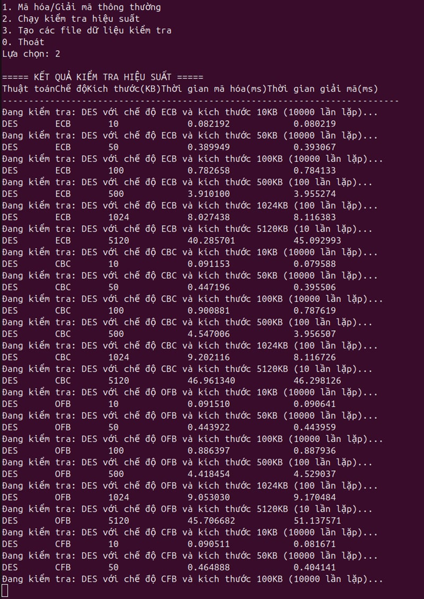
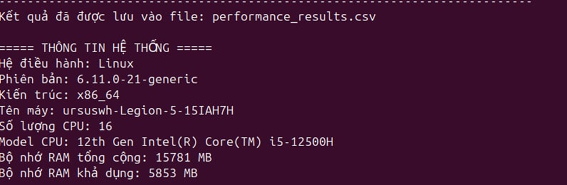

# 🔐 Lab 1 - Implementing DES & AES with Crypto++ Library

## 📚 Description
This project implements **DES** and **AES** encryption algorithms using the **Crypto++** library in C++. It supports various **modes of operation** and multiple options for **key/IV input**, **plaintext/ciphertext I/O**, and **output formats** (hex/base64/binary). Designed for both **Windows** and **Linux**, this lab also includes a performance benchmark comparison between the two OSes.

## ✅ Features

### 🔁 Modes of Operation (selectable via screen / CLI):
- ECB
- CBC
- OFB
- CFB
- CTR
- XTS
- CCM
- GCM

### 🔐 Functionalities:
- Key generation (random or from file)
- Encryption
- Decryption

### 📥 Inputs:
- **Key & IV / Nonce**:
  - Case 1: Randomly generated per run
  - Case 2: Read from file
- **Plaintext / Ciphertext**:
  - Case 1: Input from screen
  - Case 2: Read from file
  - Vietnamese supported via `setmode()` and UTF-8 encoding

### 📤 Outputs:
- Output formats: Hex / Base64 / Binary
- Display on screen and write to file

---

## ⚙️ How to Run

### 🖥 Requirements:
- C++17 or later
- [Crypto++ Library](https://www.cryptopp.com/)
- CMake (optional)
- g++ (Linux) or MSVC (Windows)
- How to set up - unzip 01_Setups and follow the pipeline

---
## 📊 Performance Report

## System information
