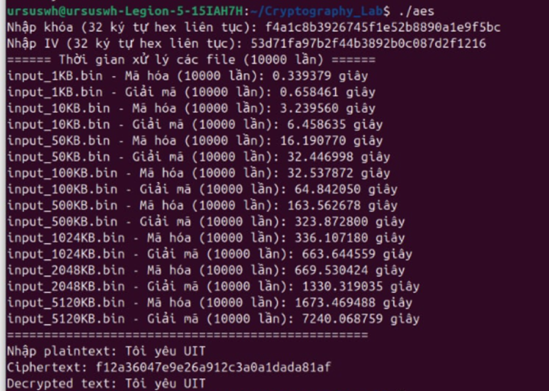

# 🔐 AES Implementation in Pure C++

This project demonstrates how to implement AES encryption and decryption using only **standard C++**, without relying on external cryptographic libraries like Crypto++ or OpenSSL.

## 📌 Features

- AES-128 encryption and decryption in **CBC mode**
- Input/output support from **screen**
- **UTF-8** encoding support for Vietnamese characters
- Command-line argument handling for mode selection
- Manual input for **Secret Key** and **Initialization Vector (IV)**
- Export cryptographic logic to `.dll` (Windows) or `.so` (Linux)

## 💡 Requirements

- C++ compiler: `g++`, `clang++`, or `cl` (Visual Studio)
- Terminal/Console that supports UTF-8 encoding

---
## 📚Performance Result

