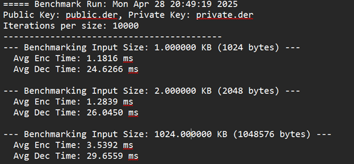

# 🔐 RSA-OAEP Cipher using CryptoPP

This project demonstrates the implementation of RSA encryption and decryption using **RSA-OAEP** padding scheme with the **Crypto++** library.

## 🧩 Features

### ✅ 1. Key Generation
- Generate RSA Key Pair (Public Key & Private Key)
- Key size: **≥ 3072 bits**
- Save keys to file in:
  - DER format
  - PEM format (optional)
- Secure storage and reuse of keys via file

### ✅ 2. Encryption
- Input Plaintext:
  - From **screen**
  - Or from **file** (UTF-8, supports Vietnamese)
- Load **Public Key** from file
- Output Ciphertext:
  - Display on screen or
  - Save to file
  - Format options: **Binary, Hex, Base64**

### ✅ 3. Decryption
- Input Ciphertext:
  - From **screen**
  - Or from **file**
- Load **Private Key** from file
- Output Recovered Plaintext:
  - Display on screen or
  - Save to file (UTF-8 supported)

## 🛠 Requirements

- **Crypto++** library installed
- C++17 or later
- Terminal/IDE with UTF-8 support for Vietnamese text
- Compiler: `g++`, `clang++`, or `cl` (MSVC)

## 📚Performance result

>[!note]⚠️ This project is intended for educational purposes. Do not use for production systems without proper security validation.